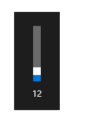
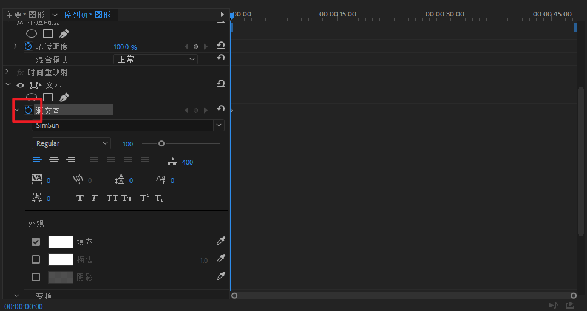

# 说明
## CloudMusicDownload
**用来快速下载 VIP 才能下的音乐（前提是可以试听）**  

复制歌曲链接（PC 客户端：分享->复制链接），然后启动程序，选择保存位置即可  

## Win10_BetterVolumeDisplay
**Win 10 更好的音量显示**  

就是这个：  

模仿移动端常用的逻辑：**点击其他地方，提示会自动关闭**  
**想要立刻关闭提示点一下其他地方即可！**

## PR_TypeWriter_Effect
**PR 打字机效果制作**  

使用方法：  
1. 按照注释编辑源码（最好在最大化 PR 窗口的情况下取坐标）

```ahk
   effectPanelX := 608 ;“效果控件”面板 X 坐标
   effectPanelY := 101 ;“效果控件”面板 Y 坐标
   programPanelX := 1186 ;“节目”面板 X 坐标
   programPanelY := 103 ;“节目”面板 Y 坐标
   frameRate := 30 ;序列帧率
   timePerChar := 0.1 ;每个字停留的时间，秒
```

2. 双击打开脚本，取消字幕输入提示框

3. 切到 PR，添加一个**文本**（不是旧版标题）
    

4. **调好字体、颜色等（很重要！现在不调待会要手动一帧一帧调）**

5. **启用文本效果中的源文本的关键帧**
    

6. 点一下添加的文本框，**确保文本框是编辑状态（也就是打字可以打上去）**

7. 按 <kbd>Ctrl</kbd> + <kbd>R</kbd>，输入字幕文本

8. 等待完成

## BakFileHelper
**添加右键菜单来快速处理 .bak 文件**  

包括：
* 双击 .bak 文件可以直接用默认程序打开（比如 .mp3.bak 会直接播放）
* “恢复 .bak 文件” 菜单
* “复制为 .bak 文件” 菜单

说明：  
双击程序直接安装，如果要卸载，在命令行加参数 `-uninstall` 运行即可

注意：  
**这个脚本只有编译之后运行才有效！**

## VolumeKeys
**映射没用的按键到音量控制键**

PrintScreen 键 -> 暂停/播放(当前播放的媒体)  
(经测试，网易云音乐和 Chrome 支持，其他的不确定)  
Scroll 键 -> 音量 -
Pause 键 -> 音量 +

## CopyBrowserTab
**Win + C 复制当前打开的浏览器标签页**  

支持 Chrome 与 Firefox

## SwitchApacheRoot
**将 Apache(phpStudy) 根目录切换到当前目录**  

只适合 phpStudy 的非服务模式！使用前记得修改 `APACHE_DIC` 为你的 Apache 根目录  
**配合 Listary 使用**  

配置说明：

截图：


