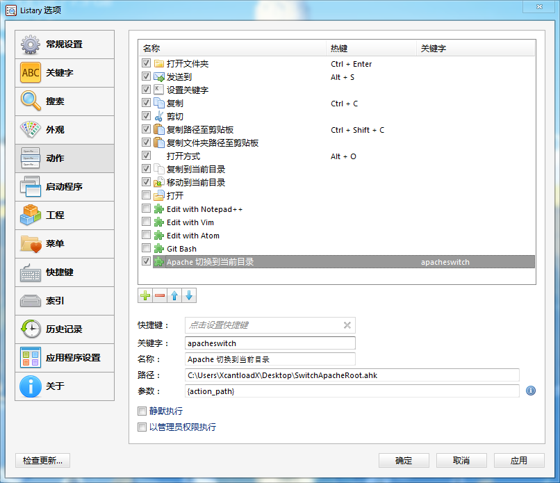
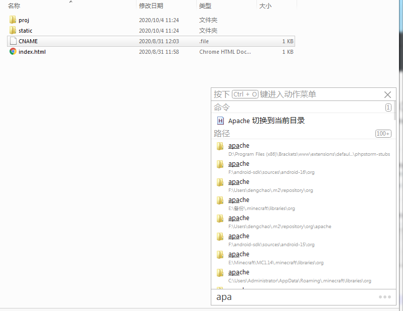

# UsefulAHKScripts
一些有用的 AutoHotKey 脚本  

## 安装
在 [Releases](https://github.com/XcantloadX/UsefulAHKScripts/releases) 里下载编译好的版本  
如果你安装了 AHK 可以直接 Clone 项目运行  

## 说明

### CloudMusicDownload
**用来快速下载 VIP 才能下的音乐（前提是可以试听）**  

复制歌曲链接（PC 客户端：分享->复制链接），然后启动程序，选择保存位置即可  

### VolumeKeys
**映射没用的按键到音量控制键**

PrintScreen 键 -> 暂停/播放(当前播放的媒体)  
(经测试，网易云音乐和 Chrome 支持，其他的不确定)  
Scroll 键 -> 音量 -
Pause 键 -> 音量 +

### CopyBrowserTab
**Win + C 复制当前打开的浏览器标签页**  

支持 Chrome 与 Firefox

### SwitchApacheRoot
**将 Apache(phpStudy) 根目录切换到当前目录**  

只适合 phpStudy 的非服务模式！使用前记得修改 `APACHE_DIC` 为你的 Apache 根目录  
**配合 Listary 使用**  

配置说明：

截图：

### BakFileHelper
**添加右键菜单来快速处理 .bak 文件**  

包括：
* 双击 .bak 文件可以直接用默认程序打开（比如 .mp3.bak 会直接播放）
* “恢复 .bak 文件” 菜单
* “复制为 .bak 文件” 菜单

说明：  
双击程序直接安装，如果要卸载，在命令行加参数 `-uninstall` 运行即可

注意：  
这个脚本只有编译之后运行才有效！

